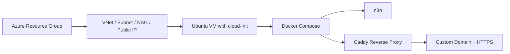

# lab-n8n-azure

Production-style n8n deployment on Azure, packaged as a small VM-based stack with Bicep, Docker Compose, and GitHub Actions.

The repository is intentionally opinionated: Azure provisions the infrastructure, cloud-init bootstraps the VM, Docker Compose runs n8n behind Caddy, and GitHub Actions handles the deploy and post-deploy flow.

## What This Repository Contains

- Azure infrastructure in Bicep for a single public VM deployment.
- A container stack for `n8n` and `Caddy`, with optional PostgreSQL support.
- Cloud-init and shell scripts that prepare the VM, deploy the stack, and keep it healthy.
- GitHub Actions workflows for OIDC bootstrap, infrastructure deployment, and post-DNS startup validation.

## Architecture

The stack runs `n8n` behind Caddy on a single Azure VM, with cloud-init handling the bootstrap and Docker Compose handling the runtime.

## Prerequisites

- An Azure subscription with permission to create resource groups, networking, and virtual machines.
- A domain you can point to the Azure public IP.
- An SSH public key for VM access.
- GitHub Actions secrets for OIDC-based Azure authentication.

## Required Deployment Inputs

The main Bicep template expects these core values:

- `domainName`: the public hostname for n8n.
- `sshPublicKey`: SSH key used for VM login.
- `n8nEncryptionKey`: a 32+ character encryption key for n8n credentials.

Common optional inputs:

- `vmSize`: defaults to `Standard_B2ms`.
- `n8nVersion`: defaults to `latest`.
- `adminUsername`: defaults to `azureuser`.
- `tlsEmail`: used for Let's Encrypt notifications.
- `environment`: `development`, `staging`, or `production`.
- `tags`, `vnetAddressPrefix`, `subnetAddressPrefix`.

## GitHub Actions Workflow Flow

The repo is built around these manual workflows:

- `00-setup-repository.yml`: initializes repository prerequisites, baseline variables, and setup checks before Azure bootstrap.
- `01-bootstrap-azure-oidc.yml`: creates or verifies Azure OIDC configuration for GitHub Actions.
- `02-verify-azure-oidc.yml`: confirms Azure authentication, checks role access, and validates the OIDC setup.
- `03-deploy.yml`: validates inputs, validates the Bicep templates, creates or updates the resource group, and deploys the stack.
- `04-start-n8n.yml`: resolves the deployed VM, confirms DNS, restarts Caddy on the VM, and verifies the live URL.
- `05-teardown.yml`: validates a destructive delete request, applies safety checks, and removes the n8n resource group.

Typical secret and variable expectations:

- `AZURE_CLIENT_ID`
- `AZURE_TENANT_ID`
- `AZURE_SUBSCRIPTION_ID`
- `GH_PAT`
- `AZURE_REGION` as a repository variable when you want a default region
- `RESOURCE_GROUP_NAME` as a repository variable when you want a default resource group name

## Getting Started

Run the workflows in this order for a clean first-time setup.

### 1. Run `00-setup-repository.yml`

Use this once to initialize repository-level prerequisites and baseline configuration expected by the later workflows.

### 2. Run `01-bootstrap-azure-oidc.yml`

Bootstrap Azure OIDC trust between GitHub Actions and Azure so workflows can authenticate without static cloud credentials.

### 3. Run `02-verify-azure-oidc.yml`

Verify authentication and permission scope before provisioning infrastructure.

### 4. Run `03-deploy.yml`

Deploy the infrastructure and VM runtime stack. Provide at least:

- `domain_name`
- `resource_group_name` (or use repository default)
- `azure_region` (or use repository default)
- `vm_size` (optional override)
- `n8n_version` (optional override)

This step validates templates and provisions networking, VM, cloud-init bootstrap, and container services.

### 5. Configure DNS

Point your domain to the deployed public IP or FQDN from workflow `03` outputs. Wait until DNS resolves correctly.

### 6. Run `04-start-n8n.yml`

Finalize service startup after DNS is ready. This restarts Caddy and validates endpoint reachability.

### 7. Validate access

Open your HTTPS URL and confirm the n8n UI is reachable.

### 8. Optional cleanup with `05-teardown.yml`

When you need to remove the environment, run teardown with explicit confirmation (`DELETE`). Use this only when you are ready to delete the resource group and all contained resources.
